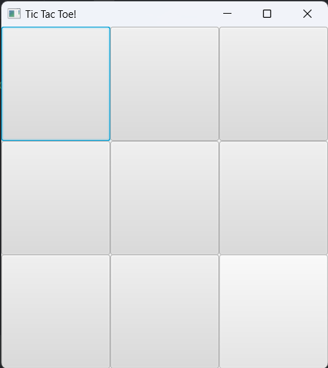
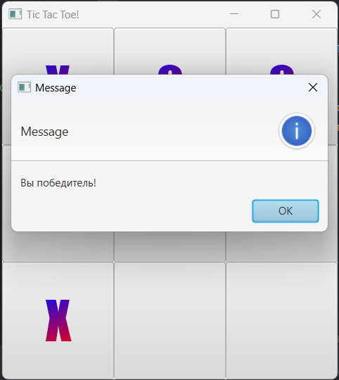

# Tic Tac Toe JavaFX

Гра Хрестики-Нолики, реалізована на JavaFX.  
Простий і зрозумілий інтерфейс, можна грати проти іншого гравця на одному комп’ютері.

---

## Скріни гри

  
_Головне вікно гри_  

  
_Приклад виграшу Х або 0_

---

## Особливості

- Реалізована логіка гри для 3x3 поля
- Перевірка переможця: рядки, стовпці, діагоналі
- Відображення повідомлення про перемогу або поразку
- Можливість почати нову гру після закінчення раунду

---

## Як запустити

1. Клонувати репозиторій:
```bash
git clone https://github.com/ТвійНік/tic-tac-toe-javafx.git
